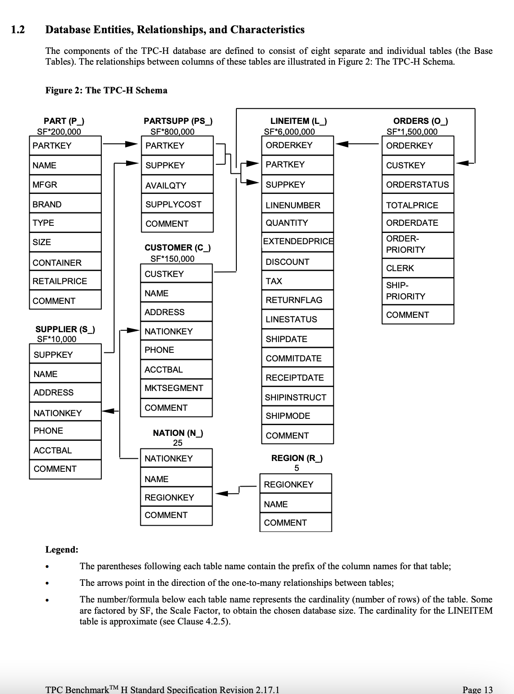

* [Advanced Data Transformation in SQL Workshop](#advanced-data-transformation-in-sql-workshop)
    * [Prerequisites](#prerequisites)
    * [Setup](#setup)
        * [Option 1: Github codespaces (Recommended)](#option-1-github-codespaces-recommended)
        * [Option 2: Run locally](#option-2-run-locally)
    * [Start here](#start-here)
    * [Data Model](#data-model)

# Advanced Data Transformation in SQL Workshop

## Prerequisites

1. Sign up for a Github account
2. Go through [SQL basics workbook](./0-basics.pdf)

## Setup

You have two options to run the exercises in this repo

### Option 1: Github codespaces (Recommended)

Steps:

1. Create [Github codespaces with this link](https://github.com/codespaces/new?skip_quickstart=true&machine=basicLinux32gb&repo=833339774&ref=main&geo=UsEast).
2. Wait for Github to install the [requirements.txt](./requirements.txt)
3. Start Jupyter notebook with the command `jupyter lab` and click on the link on the screen.

### Option 2: Run locally

Steps:

1. Clone this repo, cd into the cloned repo.
2. Start a virtual env and install requirements.
3. Start Jupyter lab and run the `ipynb` notebooks.

```bash
git clone https://github.com/josephmachado/adv_data_transformation_in_sql.git
cd adv_data_transformation_in_sql
python -m venv ./env # create a virtual env
source env/bin/activate # use virtual environment
pip install -r requirements.txt
jupyter lab
```

## Start here

Run the jupyter notebook [0-basics.ipynb](./0-basics.ipynb) to get started.

## Data Model

The TPC-H data represents a car parts seller’s data warehouse, where we record orders, items that make up that order (lineitem), supplier, customer, part (parts sold), region, nation, and partsupp (parts supplier). 

Note: Have a copy of the data model as you follow along; this will help in understanding the examples provided and in answering exercise questions.



